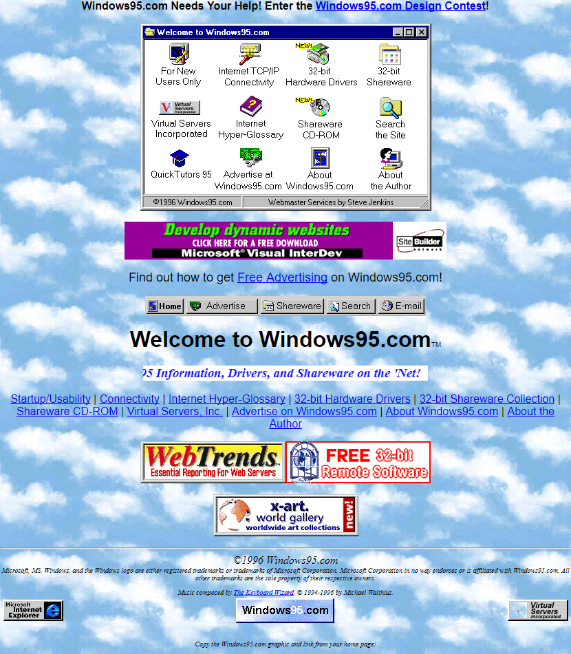

<<<<<<< HEAD
## Syfte

Målet med detta projekt var att modernisera en omodern hemsida med fokus på UI/UX, samtidigt som kärninnehållet från originalet (Windows95.com) behålls.
Jag har behållit temat kring Windows 95, men presenterat det på ett mer modernt och användarvänligt sätt.
Syftet var att visa hur samma innehåll kan upplevas helt annorlunda genom förbättrad design, struktur och användarupplevelse.

## Strategi

Jag har valt att behålla innehållet men förbättra strukturen, designen och användarupplevelsen.
Fokus har legat på att förbättra användarens flöde genom sidan, så att det snabbt går att förstå vad sidan erbjuder och hur man navigerar vidare.
Målet har varit att visa hur samma typ av webbplats kan upplevas mer tydlig, modern och lättanvänd med hjälp av förbättrad UI/UX.

## Förändringar och förbättringar

- Jag har lagt till Windows 95-loggan, då det är en central del av varumärket som saknades i originalet.
- Jag har använt molnbakgrunden i hero-sektionen istället för över hela sidan, eftersom den annars blir rörig och försämrar kontrast och läsbarhet.
- Jag har behållit konceptet med ikoner, men gjort om dem till tydliga klickbara knappar och slagit ihop vissa delar till mer logiska kategorier.
- Jag har tagit bort lösa och duplicerade länkar, då de ofta ledde till samma innehåll och skapade onödig förvirring.
- Jag har lagt till en tydlig navigationsmeny för att göra sidan mer lättnavigerad.
- Jag har behållit “Free Advertising”-idén, men presenterat den som en egen sektion med tydligare struktur och mer genomtänkt design.
- Jag har ersatt den lilla “Email”-knappen med en modern kontaktsektion, men behållit knappen som en visuell koppling till originalet.
- Jag har lagt till funktionerna “Play startup sound” och “Dark mode”.
  - Startup-ljudet förstärker kopplingen till Windows 95
  - Dark mode bidrar till en modern användarupplevelse
- Jag har förenklat footern genom att ta bort överflödigt och rörigt innehåll.
- Jag har strukturerat sidan i tydliga sektioner för bättre överblick och läsbarhet.
- Eftersom originalet innehåller väldigt lite text har jag lagt till beskrivande innehåll för att tydliggöra konceptet.
- Sidan är byggd responsivt för att fungera på mobil, tablet och desktop.

## Original

=======

>>>>>>> linda
